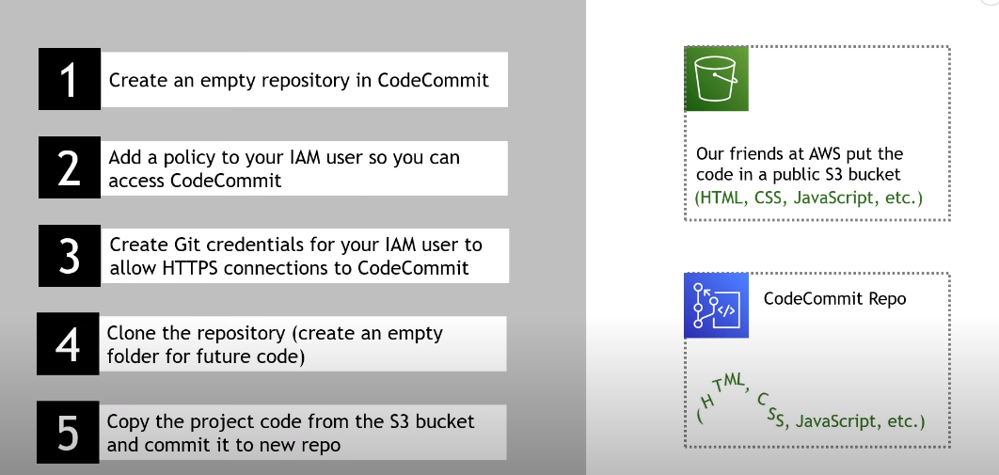

# AWS-Website
Website deploying in AWS

1. ArcGIS - for map
2. store/update/pull code - Github / CodeCOmmit- you can use github also- We took the code from this, aws s3 cp s3://wildrydes-[your_region_name, like us-west-2]/WebApplication/1_StaticWebHosting/website ./ --recursive
3. permission for the code
4. hosting website and make updates
5. User to register and log in
6. ride sharing functionality
7. store.return ride results
8. invoke ride sharing functionality

