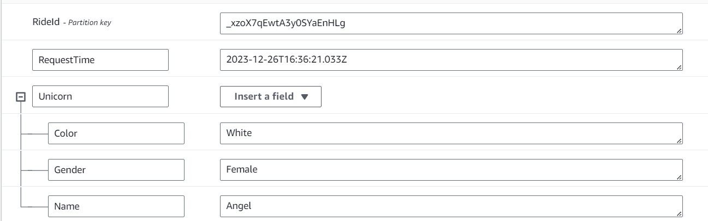
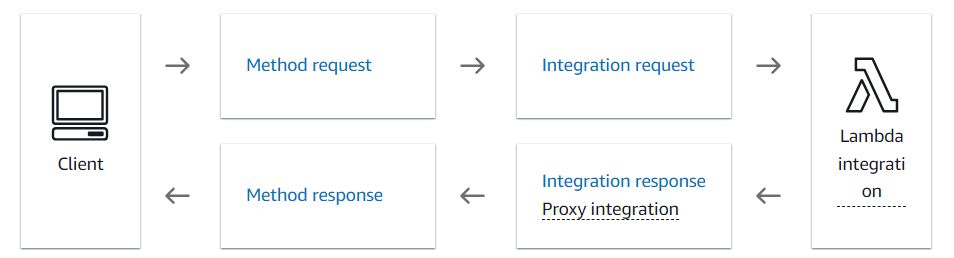
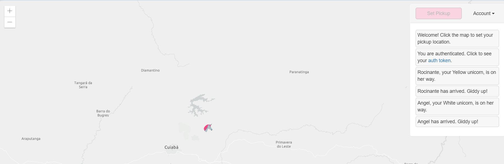
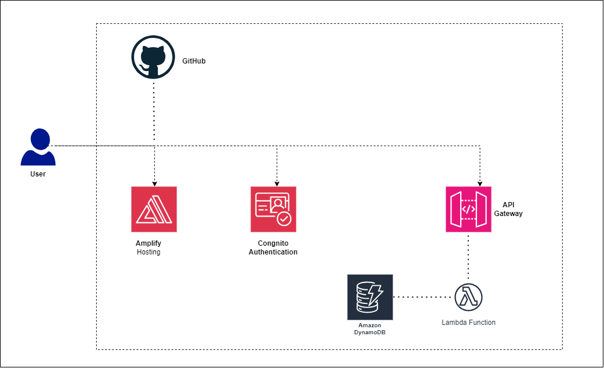

# AWS-Ride Sharing Website
Ride sharing website - deploying in AWS

hosting website and make updates -- You can use codeCommit or github and then connect that with Amplify to deploy your code, you can also changes something inside the code and check if amplify working with continuous development or not

User to register and log in - cognito [userPool] ( used to authentication)

ride sharing functionality (user will request a ride, and unicorn wll go)-- for this we will use Lambda, basically Lambda will help us to run code serverlessly ipon some tigger. 

store.return ride results -- We will use a NoSql Databases (key-value) which is DynamoDB , So in general user will request a ride then a unicorn will be sent and that ride things will be save in a Table. For that Firstly set up the DynamoDB , then the Lambda function.

invoke ride sharing functionality -- API Gateway ( Rest API)

Then the integration of the map- Creat a free account in ArcGIS

The Whole Architecture 

## Notes: After testing this, do not forget to delete the app from amplify, table from DynamoDB and lambda functions, congnito also, so that it won't cost you anything. 

###### The code is from AWS. Command to copy code from AWS’s S3 bucket (from CloudShell command line): aws s3 cp s3://wildrydes-[your_region_name, like eu-north-1]/WebApplication/1_StaticWebHosting/website ./ --recursive

